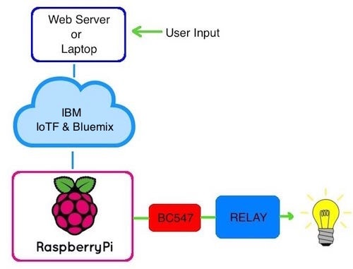
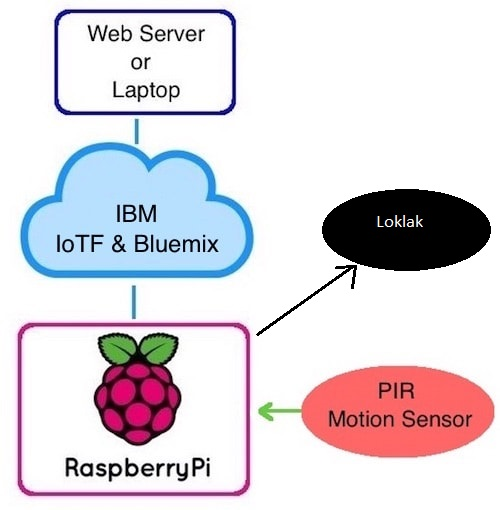
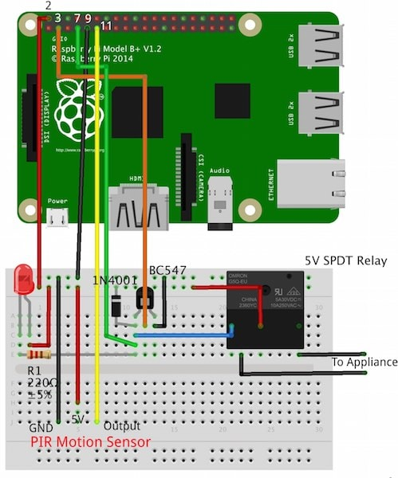

# IoT
Internet of Things based home automation project using IBM IoTF platform.
Original Tutorial:  http://diyhacking.com/raspberry-pi-home-automation-ibm-bluemix/

This repository consists of two scripts:
client.py - This python script runs on the Raspberry Pi. It accepts commands from the server and pushes data from a PIR motion sensor to the IBM IoTF platform, At the same time it also cretes the impact

server.py - This python script runs on the web server and issues commands that control the GPIO pins on the Raspberry Pi. Before running this script on the server, you should install the corresponding packages for IBM IoTF by doing `pip install ibmiotf`. The server also pushes the same data to loklak, this is done by installing the loklak python SDK by doing `pip install python-loklak-api`

1. Sending commands to the Raspberry Pi
The server side script running on our laptop or on a web server takes input commands from the user and correspondingly sends it to the client (Raspberry Pi). Here, we will be using commands to turn a light ON/OFF. When we pass the command to turn ON a light through the server side script, the information is relayed to the Raspberry Pi and it’s GPIO pin turns ON a relay. The system also sends status updates to the server on whether the light is ON/OFF.

2. Receiving data from the Raspberry Pi
In case of sending data from the PIR motion sensor connected to the Raspberry Pi, we run a script which reads the sensor through a GPIO pin and broadcasts the data through the IoTF platform. This can then be viewed through the IoTF console or through a custom web application designed using the platform.

Once the data is obtained at the rasperry pi, then the raspberry pi sends the same information to Loklak Server to which it's been configured to.

GPIO pin 3: To provide the control signal to BC547 which in turn activates the relay.
GPIO pin 7: To monitor the status (ON/OFF) of the appliance connected to the relay.
GPIO pin 11: To provide the status for intruder detection via the PIR motion sensor (0/1).
